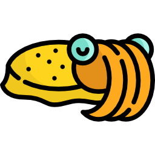

# cuttlefish



Switch environment according to current working directory. Heavily inspired by the amazing [direnv](https://direnv.net/) but not limited to environment variables and only targeting [fish shell](https://fishshell.com).

## Features

Configure any combination of the following in a simple YAML file:
- ssh identities
- paths (to append to `$fish_user_paths`)
- global variables
- git user email address

Whenever you visit a directory containing a `.cuttlefish.yaml` file, its configuration is applied to your environment.

**Note:** Only subdirectories of the user's home directory are scanned.

## Install

**Note:** The script installs itself in your `~/.config/fish/config.fish`: before doing so, though, it will copy the original file to `~/.config/fish/config.fish_bck` so that it can be restored if needed (see `install` target in `Makefile` for more details).

### Option 1: Install released binaries

Grab the binaries from the [releases page](https://github.com/fedragon/cuttlefish/releases), uncompress them and run

```
cd cuttlefish-darwin64
make install
```

### Option 2: Build from sources

The installation requires Go 1.13+.

```
git clone https://github.com/fedragon/cuttlefish
cd cuttlefish
make
```

### Usage

Create a `.cuttlefish.yaml` in every directory where you want to load a different environment. The file should look like this:

```yaml
git_config:
  email: foo@bar.com # only this field is currently supported
ssh_identities:
  - ~/.ssh/id_rsa1
  - ~/.ssh/id_rsa2
# - ...
user_paths:
  - ~/Documents
  - ~/Desktop
# - ...
global_variables:
  FOO: bar
# x: y
# ... : ...
```

Any combination of the above fields is possible and they're all optional. A complete example is available in `examples/cuttlefish.yaml`.

### Uninstall

```
cd cuttlefish
make uninstall
```

## Develop

### Build

```
make build
```

### Test

```
make test
```

### Release

```
make release
```

## Credits

Cuttlefish logo made by [Freepik](http://www.freepik.com/).